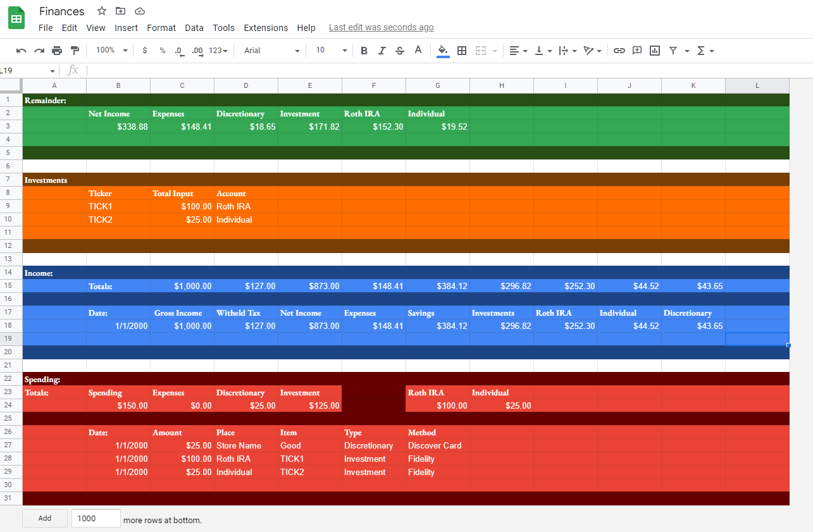

  
&emsp;When I started my first Co-op at Ameren, I wanted to maintain a spreadsheet that tracked each paycheck and stratified gross income into different categories so that I would know exactly how much money to put towards expenses, savings, investments, etc. However, manually entering each time I get a paycheck or spend money somewhere is tedious and time consuming, so I am building this tool to automate the process.
  
&emsp;This project is just getting started. Most core functionality has been implemented, but much more critical functionality and features have yet to be added. The end goal is simple. Any time I receive a check or make a purchase, I can click a button on my phone that will communicate with my home Linux server, run this program, and update the spreadsheet with current financial data. I chose this route mostly to learn how to utilize a Linux machine and communicate outside of my home network, but its also an easier way for me to have the most up to date information as opposed to leaving the program to execute every a few times a day even when no transactions occur.

At its core, this program should accomplish the following once it is complete:
<pre>
    - Update Google Sheet with new data
    - Get data from the Google Sheet
    - Scrape my financial institutions' webpages for my personal income/spending data
    - Run in my home Linux environment
    - Be able to be updated easily to align with changes in financial institutions and/or their websites
</pre>
And, it currently uses the following tools in its implementation:
<pre>
    - Selenium
    - Undetected Chromdriver
    - GSpread
    - Google Sheets API
</pre>
  
  
  
Everything starts with the spreadsheet, which is broken down into four categories: Spending, Income, Investments, and Remainder.
  <pre>
Spending - Tracks any outward cash flow from my bank account. Total spending is broken down into expenses, investment, and discretionary spending. Each purchase is recorded with the date, amount, place, item (websites tend to give merely categorical data i.e. 'Restaurants' from Domino's but not 'Pizza'), type, and method.
      
Income - Tracks paychecks, displaying gross income, tax witholdings, net income, and the proportion of net income I've elected to partition into expenses, savings, investment accounts, and discretionary spending. Will accomodate for any non-paycheck income in the future.
      
Investments - Tracks the total amount paid into each position, and the account it was purchased under. This section could evolve into a whole development of its own, but in the short term I will simply be adding the current values for each position in the future.
      
Remainder - Tracks income I've alloted to a particular category that has yet to be spent. Quickly shows exactly how much money is left in my budget for each category.
</pre>    
  

